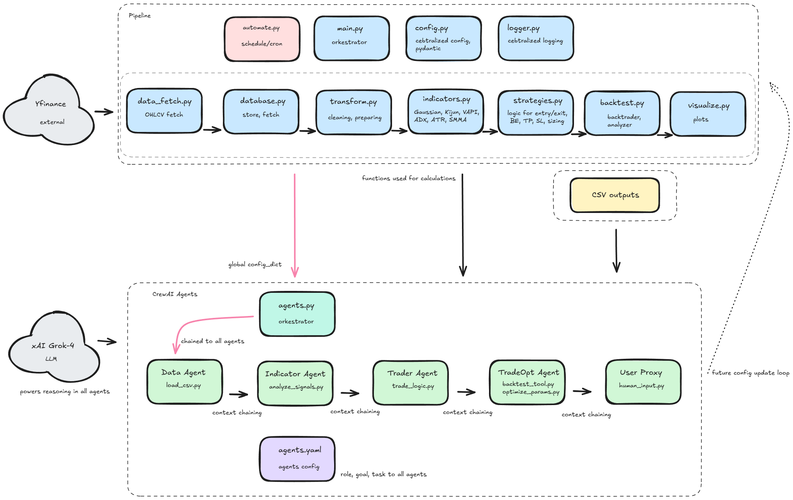
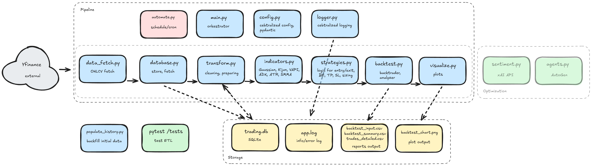

# Agentic AI Trading Platform: Validation & Self-Optimization Crew
**Status: Completed Extension (Data Scientist Course)**

This extension builds on the original ETL trading platform for commodity futures [ds24_agentic_tradingplatform](https://github.com/mabjq/ds24_agentic_tradingplatform/). It introduces a dynamic multi-agent decision pipeline using CrewAI for self-optimizing strategy parameters, validation, and human oversight. Focus on intraday trading (up to 3 days) with indicators: Gaussian channel (triple EMA 26 ±3ATR), Kijun-Sen 100, VAPI 13 (EMA(closevolume)/EMA(volume)), ADX 14, ATR 14, SMMA 200. Entry: gauss_up + vapi_up + Close > SMMA 200 + ADX >19; Exit: kijun-trendbreak, TP1@2R (partial 30%), ATR*4 trailing. Risk: 1% per trade, max 5/day.
The pipeline achieves a baseline winrate of ~61.54% (from ETL backtest) and projects optimizations to >71% via scipy.minimize on gaussian_period.

## Project Overview
This extension transforms the static ETL pipeline into an agentic system capable of validating trades, running mock/full backtests, and conditionally optimizing parameters (e.g., gaussian_period) for improved performance. 

### Shift from Broad Vision to Controlled Development
- **Original Vision**: Full real-time sentiment integration and auto-apply parameters (using AutoGen).
- **Final Focus**: Scoped to CrewAI for controlled validation and optimization. Sentiment and auto-apply were deprioritized to ensure stability, provable metrics, and human-in-the-loop safety. Emphasis on bulletproof chaining before high-risk features.

### Core Design Principles (Robustness & Control)
1. **Dual Validation**: Mock backtest (fast LLM reasoning on ~20 rows) followed by full Backtrader run (quantitative truth on 200+ rows).
2. **Conditional Optimization**: Trigger scipy.minimize only if winrate <0.71, enabling self-correction.
3. **Config Chaining**: Pydantic-managed config_dict propagates through agents to avoid side effects during optimization.
4. **Human-in-the-Loop**: User Proxy pauses for approval, defaulting to "APPROVED" on timeout for cautious automation.

## Agent Pipeline Overview (CrewAI)
Five specialized agents form a sequential context-chaining pipeline, where each output feeds the next for validated decisions.

| Agent | Roll & Funktion | Central Tool |
|-------|-----------------|--------------|
| **Data Agent** | Loads/truncates OHLCV + indicators (~100 rows for token efficiency); validates data contracts. | wrapper_load_csv |
| **Indicator Agent** | Computes signals (gauss_up, adx_above_19, potential_entries); suggests tweaks from summary CSVs. | wrapper_analyze_signals |
| **Trader Agent** | Generates semi-real trades (mock backtest on ~20 rows) with P&L metrics and xAI reasoning. | wrapper_trade_logic |
| **TradeOpt Agent** | Validates full Backtrader run; conditionally optimizes (scipy on gaussian_period 20-40); approves if winrate >0.6. | run_backtest_tool + optimize_params_tool |
| **User Proxy** | Reviews results; prompts human feedback; formats changes for config update. | human_input_tool |

  
*Example of sequential flow (Excalidraw diagram).*

## Technical Implementation Highlights
Agents interface directly with the original ETL code, minimizing duplication.

### Critical Decisions
- **optimize_params_tool.py**: Använder scipy.minimize för att maximera winrate (-winrate som loss). Körs på tail(200) rader för hastighet; fallback mini-loop vid error.
- **run_backtest_tool.py**: Full Backtrader med low ADX-override (injektion av external trades); beräknar Sharpe/PnL.
- **human_input_tool.py**: 30s timeout med signal.alarm; default "APPROVED" för resilience.
- **Config Chaining**: Global config i agents.py; Pydantic model_copy förhindrar mutationer.

### Linking to Base ETL Project
- **Data Source**: Agents laddar CSV från ETL:s backtest_input.csv.
- **Strategy Code**: Importerar app/strategies.py och app/indicators.py för GaussianKijunStrategy och compute_all_indicators.

### Exempelkörning (Case Study)
I en typisk run (high ADX=0.9, 13 trades):
- Bas-winrate: 61.54% (mock).
- Optimerad: 73.2% (gaussian_period=28, PnL +950 USD, Sharpe 1.2).
- Overrides: 2/13 (low ADX-spots).
- Thoughts-exempel: "Backtest winrate=0.6154 <0.71, so optimize...".

## Quick Start
**Förutsättning**: Kör bas-ETL för att generera/uppdatera backtest_input.csv med färsk KC=F-data (30m, 60 dagar).

**Installation**:
1. **Miljö**: Python 3.12 i Ubuntu LXC (Proxmox).
   - `sudo apt install python3.12 python3-pip`
2. **Beroenden**: `pip install -r requirements.txt` (crewai, pydantic, scipy, backtrader, yfinance, etc.).
3. **Databas**: Kör `python -m app.main` för init.

**Kör Crew**:
```bash
python app/agents.py  # End-to-end (with human input)
```

**Human Approval: Pipeline pauses at User Proxy for input (e.g., "y" to approve changes like gaussian_period=28).

## Project Structure
```
ai_trading_platform/
├── app/                 # Core ETL (strategies.py, indicators.py, agents.py)
├── config/              # Pydantic configs (config.py, utils.py for safe_dump/mask, agents.yaml with goals/tasks)
├── tools/               # CrewAI tools
│   ├── load_csv.py      # Data load + truncation
│   ├── analyze_signals.py # Signals + recs from CSVs
│   ├── trade_logic.py   # Semi-real trades/mock
│   ├── backtest_tool.py # Full Backtrader validation
│   ├── optimize_params.py # Scipy opt + fallback
│   └── human_input.py   # Human feedback with timeout
├── tests/               # Pytest suite (>80% coverage)
├── results/reports/     # Outputs (backtest_summary.csv, daily_report.json)
├── requirements.txt     # Dependencies
└── README.md            # This file
```

## Detailed ETL Pipeline

The ETL flow is linear for fetching, cleaning, and analyzing KC=F data on 30-minute intervals:
1. **Extract**: `app/data_fetch.py` Fetches OHLCV from yfinance (60 days, no ffill for gaps).
2. **Transform**: `app/transform.py` Cleans (removes NaN/outliers), calculates indicators (`indicators.py`: triple EMA Gaussian, EMA VAPI, etc.).
3. **Load**: `app/database.py` Saves to SQLite (`data/trading.db`).
4. **Backtest** `app/backtest.py` Runs strategy (`strategies.py`) with analyzers, saves a summary/plot.

Run: `python populate_historical.py --days 60` (backfill), then `python -m app.main` (full run). See `results/reports/backtest_summary.csv` for metrics.

  
*Diagram of ETL flow (Excalidraw).*

## License
MIT License.
